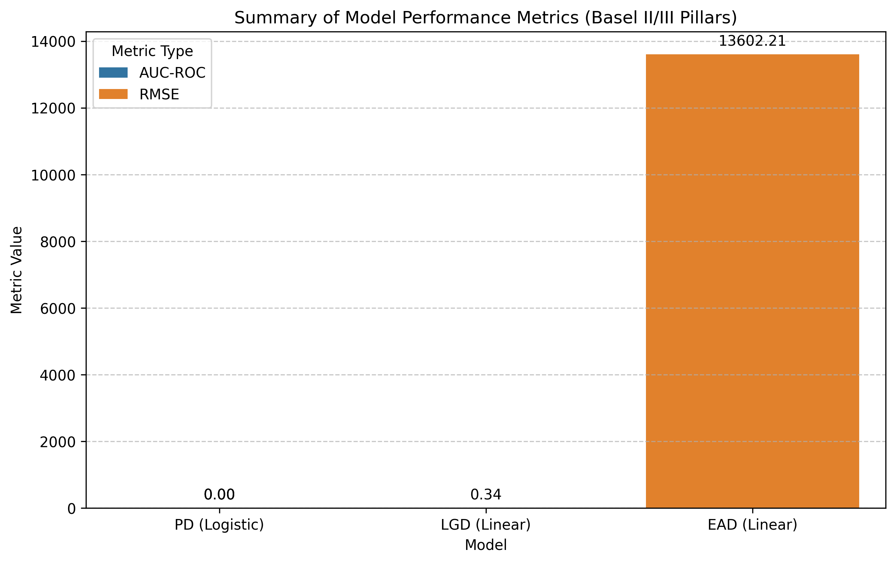

# Credit Risk Modeling: Basel II/III (PD, LGD, EAD)

This project implements a credit risk modeling framework based on the Basel II/III pillars using Python. It covers the end-to-end pipeline from data preprocessing to Expected Loss (EL) estimation.

## Project Structure

- `DATA_PROCESSING/`: Modular notebooks for missing values, outlier handling, categorical encoding, and data splitting.
- `MODELS/`: Notebooks for baseline model training (Logistic/Linear Regression) and evaluation metrics.
- `Credit_Risk_Model_Definition.ipynb`: Documentation of dataset schema and Basel targets.
- `Credit_Risk_Model_Interpretations.ipynb`: Business drivers and regulatory alignment logic.

## Key Components

1. **PD (Probability of Default)**: Modeled via Logistic Regression to predict binary default status.
2. **LGD (Loss Given Default)**: Modeled via Linear Regression to estimate recovery rates on defaulted loans.
3. **EAD (Exposure at Default)**: Modeled via Linear Regression to predict total exposure at time of default.

## Expected Loss Formula

**EL = PD × LGD × EAD**

## Getting Started

1. Run the preprocessing notebooks in `DATA_PROCESSING/`.
2. Train the models using the training notebook in `MODELS/`.
3. Evaluate performance and interpret coefficients to ensure regulatory transparency.

## Summary Visualization

